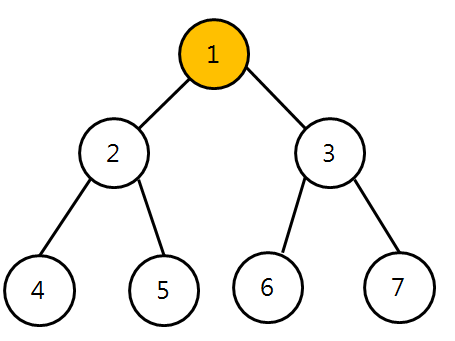
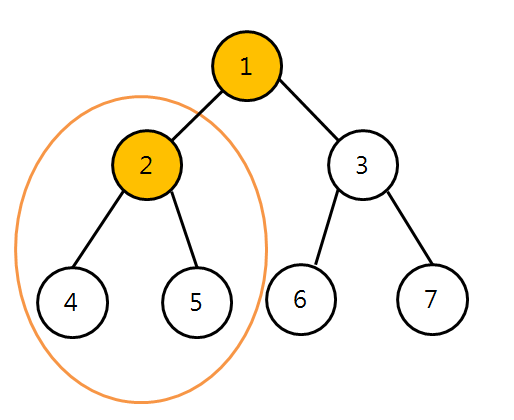

# 2. 트리의 순회

## 1. 트리 순회의 개념 및 이진트리

- 트리 내에 어떠한 자료가 담겨있는지를 알기 위함 
- 자료구조 = 주머니 
- 노드를 방문해가면서 보겠다~ 
- 재귀적 성질 이용해서 순회하는 것이 가장 유명하고 중요함. 
- 자식 노드가 항상 2개 이하인 아이를 배움
  - 모든 노드가 자식을 최대 2개 가지고 있음 
  - '이진트리'라고 부름(Binary Tree) 

## 2. 이진 트리의 전위 순회

- 트리 내에 어떤 자료가 담겨있는지를 알기 위함.

  - 전위순회: Root-L-R 

  - 중위순회: L-Root-R

  - 후위순회: L-R-Root 

    ​       Root

    L 			   R

  - Root: Root 노드를 처음에 방문한다(체크한다=노드의 값이 뭔지 알아낸다.)

  - L: left subtree를 순회한다.

  - R:right subtree를 순회한다.  

    
  
  
  
  
  - 1-2-4-5-3-6-7

- 중위순회: L-Root-R

  4- 2-5-1-6-3-7

- 후위순회: L-R-Root

  4-5-2-6-7-3-1

- 순회하는 순서만 다름, 순회가 목적임.(`트리 내에 어떤 자료가 담겨있는지를 알기 위함` )

- 특성이 다르다: 보장하는 것(조건)이 다름.
- 모든 노드를 하나도 빼놓지 않고 다 방문함. 
- 트리의 재귀적 특성을 이용한 순회방법
  - 전위순회할 때는 또, 전위 순회를 써라~
  - 중위순회할 때는 또, 중위 순회를 써라~
  - 후위순회할 때는 또, 후위 순회를 써라~