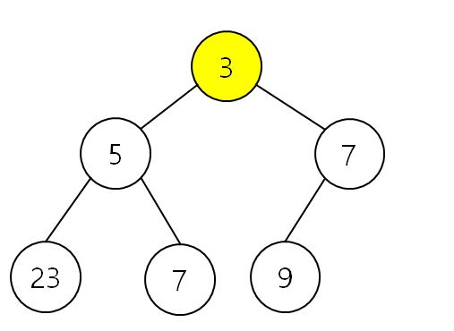
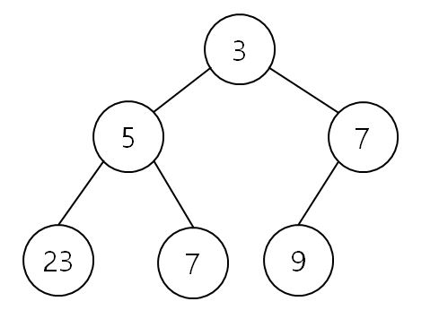
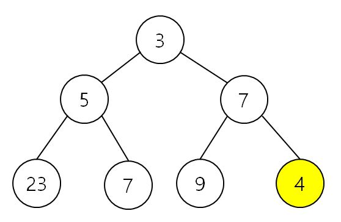
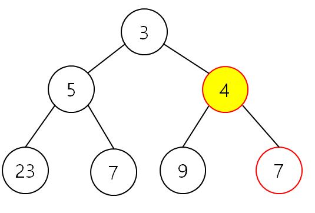

# 힙의 개념

## 1. 힙의 개념

**부모의 값이 항상 자식보다 작은 `완전 트리`**

- 부모일수록 우선순위가 높다. 
- 완전 이진 트리: 왼쪽에서 오른쪽으로 노드들이 채워짐
- 1) 값을 추가할 수 있다.
- 2) 값을 제거할 수 있다.
- 힙의 루트가 가장 우선순위가 높다. 
- 우선 순위 높은 것 바로 알 수 있고 바로 제거 가능 (우선순위 큐의 기능)
- 그런데 값 추가, 제거 시 힙을 재구성해야 함

## 2. 힙의 삽입 연산

- 값이 4인 노드 추가

- 부모 노드가 자식 노드보다 항상 우선순위가 커야 함
- 그런데 우선순위가 깨졌네..?(4와 7이 문제야 문제)
- -> 두 수의 자리를 바꾸자!

- 그리고 4와 3을 비교하면 3 < 4 이므로 우선순위 문제 없음!

## 3. 힙의 삽입 연산의 시간복잡도

### 완전 이진트리의 높이

노드가 n 개 -> 높이는?

| 노드의 개수 | 높이 |
| ----------- | ---- |
| 1=2^1-1     | 1    |
| 2           | 2    |
| 3=2^2-1     | 2    |
| 4           | 3    |
| 5           | 3    |
| 6           | 3    |
| 7=2^3-1     | 3    |
| 8           | 4    |
| 9           | 4    |

15=2^4-1																				4

- 높이는 1증가하는데 노드 개수는 거의 2배가 증가해야 함. 

- 왜 이런 상황이 발생하는가?

  -> 완전 이진트리이기 때문!

- 각 높이 별로 노드의 개수 셀 수 있음(노드가 2배씩 증가)

- 높이 하나가 증가하기 위해서는 전 레벨 노드의 2배만큼이 필요함.

- 노드의 개수의 지수가 높이와 같음 --> 로그...?

- 노드가 n개일 때, 높이가 log n이다.

- 높이가 1 커지면 노드의 개수가 2배가 됨.

### 힙: 값 삽입의 시간복잡도

- 노드가 n개일 때 높이가 log n이다.

- 원소 삽입 시, 삽입 노드는 계속 위로 올라간다. (최대: 트리의 높이)

  --> 시간 복잡도: O(log n) --> 굉장히 짧은 시간복잡도 --> 효율성 Good!

## 4. 힙의 삭제 연산

## 5. 힙의 삭제 연산의 시간복잡도

## 6. 우선순위 큐의 구현 방법 요약 

## 7. 힙의 구현1

## 8. 힙의 구현2

## 9. 힙의 성능

